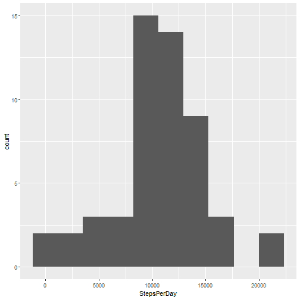
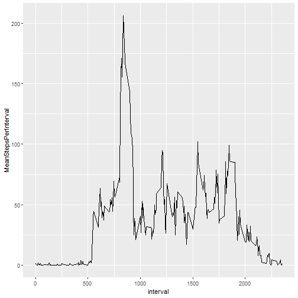
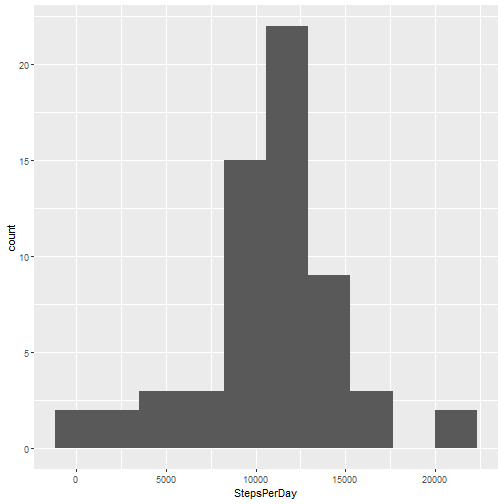
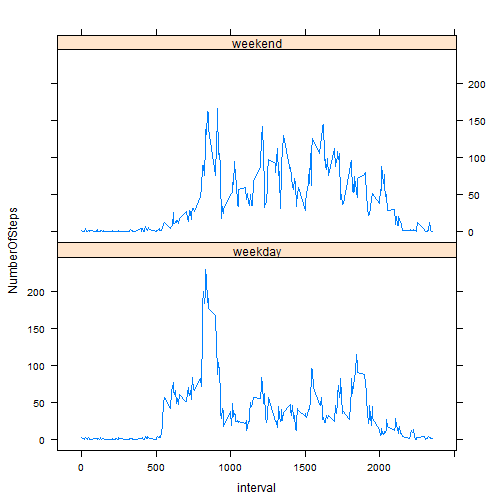

First loading some useful libraries:


```r
library(data.table)
library(ggplot2)
library(lattice)
```
Now it is time to grab the file:


```r
destfile <- "./week2/repdata_data_activity"
outDir <- "./week2/uitgepakt"

urlie <- "https://d396qusza40orc.cloudfront.net/repdata%2Fdata%2Factivity.zip"

if(!dir.exists("week2")) {
  dir.create("week2")
} 

if(!file.exists(destfile)) {
  download.file(urlie, destfile)
  unzip(destfile, exdir=outDir)
}

filename <- list.files(outDir, recursive = T)
```

#### Loading and preprocessing the data
Show any code that is needed to

1) Load the data (i.e. read.csv())
2) Process/transform the data (if necessary) into a format suitable for your analysis

Answer: I load the activity file and turn it into a nice data table. Fread can do that all at once!

```r
DT_Activity <- fread(paste0(outDir, "/", filename))
```

What now follows is a lot of questions but also decent answers I would say.   


   
####    What is mean total number of steps taken per day?
For this part of the assignment, you can ignore the missing values in the dataset.
 
1) Calculate the total number of steps taken per day 

Comment to answer: I was not sure about ignoring the missing values. Is it about ignoring dealing with missing values, or
ignore them by removing them in the overview? I choose for the latter. 

```r
DT_Activity[!is.na(steps), .(StepsPerDay = sum(steps)), date]
```

```
##           date StepsPerDay
##  1: 2012-10-02         126
##  2: 2012-10-03       11352
##  3: 2012-10-04       12116
##  4: 2012-10-05       13294
##  5: 2012-10-06       15420
##  6: 2012-10-07       11015
##  7: 2012-10-09       12811
##  8: 2012-10-10        9900
##  9: 2012-10-11       10304
## 10: 2012-10-12       17382
## 11: 2012-10-13       12426
## 12: 2012-10-14       15098
## 13: 2012-10-15       10139
## 14: 2012-10-16       15084
## 15: 2012-10-17       13452
## 16: 2012-10-18       10056
## 17: 2012-10-19       11829
## 18: 2012-10-20       10395
## 19: 2012-10-21        8821
## 20: 2012-10-22       13460
## 21: 2012-10-23        8918
## 22: 2012-10-24        8355
## 23: 2012-10-25        2492
## 24: 2012-10-26        6778
## 25: 2012-10-27       10119
## 26: 2012-10-28       11458
## 27: 2012-10-29        5018
## 28: 2012-10-30        9819
## 29: 2012-10-31       15414
## 30: 2012-11-02       10600
## 31: 2012-11-03       10571
## 32: 2012-11-05       10439
## 33: 2012-11-06        8334
## 34: 2012-11-07       12883
## 35: 2012-11-08        3219
## 36: 2012-11-11       12608
## 37: 2012-11-12       10765
## 38: 2012-11-13        7336
## 39: 2012-11-15          41
## 40: 2012-11-16        5441
## 41: 2012-11-17       14339
## 42: 2012-11-18       15110
## 43: 2012-11-19        8841
## 44: 2012-11-20        4472
## 45: 2012-11-21       12787
## 46: 2012-11-22       20427
## 47: 2012-11-23       21194
## 48: 2012-11-24       14478
## 49: 2012-11-25       11834
## 50: 2012-11-26       11162
## 51: 2012-11-27       13646
## 52: 2012-11-28       10183
## 53: 2012-11-29        7047
##           date StepsPerDay
```

2) If you do not understand the difference between a histogram and a barplot, research the difference 
  between them. Make a histogram of the total number of steps taken each day


```r
ggplot(DT_Activity[!is.na(steps), .(StepsPerDay = sum(steps)), date], aes(x=StepsPerDay)) + geom_histogram(bins = 10)
```



 3) Calculate and report the mean and median of the total number of steps taken per day


```r
DT_Activity[, .(StepsPerDay = sum(steps)), date][,.(MeanStepsPerDay = mean(StepsPerDay, na.rm = T), MedianStepsPerDay = median(StepsPerDay, na.rm = T))]
```

```
##    MeanStepsPerDay MedianStepsPerDay
## 1:        10766.19             10765
```

#### What is the average daily activity pattern?
   1) Make a time series plot (i.e. type = "l" of the 5-minute 
 interval (x-axis) and the average number of steps taken, averaged across all days (y-axis)

```r
StepsPerInterval <- DT_Activity[, .(MeanStepsPerInterval = mean(steps, na.rm = T)), .(interval)]
ggplot(StepsPerInterval, aes(x = interval, y = MeanStepsPerInterval)) + geom_line()
```



2) Which 5-minute interval, on average across all the days in the dataset, contains the maximum number of steps?


```r
StepsPerInterval[MeanStepsPerInterval == max(MeanStepsPerInterval)]
```

```
##    interval MeanStepsPerInterval
## 1:      835             206.1698
```

#### Imputing missing values
 
Note that there are a number of days/intervals where there are missing values 
 (coded as NA). The presence of missing days may introduce bias
 into some calculations or summaries of the data.
 
 1) Calculate and report the total number of missing values in the dataset (i.e. the
    total number of rows with NAs

```r
DT_Activity[is.na(steps), .N, ]
```

```
## [1] 2304
```
 2) Devise a strategy for filling in all of the missing values in the dataset. The strategy 
    does not need to be sophisticated. For example, you could use the mean/median for that day, 
    or the mean for that 5-minute interval, etc.
 3) Create a new dataset that is equal to the original dataset but with the missing data filled in.

 Answer: The appearance of NA's are an on/off thing for days, if NA's appear then there are 
 no steps at all for that day and vice versa. Therefore it is not possible to use the mean/median
 for specific days (because they don't exist for NA-infected days), for imputation the means or medians 
 for 5-minute intervals for all days should be used. I use means, because I like means more than medians. 
 Further I do 2 and 3 together, because I am a bit recalcitrant.

 To be sure, in case I destroy things I make a backup column:

```r
DT_Activity$steps_original <- DT_Activity$steps
```

 step 1, determine mean steps per interval and add this as a column. I will use this very soon to replace the NA's in 'steps'. 

```r
DT_Activity[, MeanStepsPerInterval:= mean(steps, na.rm = T), by = interval]
```

 step 2, if 'steps' contains NA's, then replace the NA's with the information in column 'MeanStepsPerInterval'.

```r
DT_Activity[is.na(steps), steps:= round(MeanStepsPerInterval, digits = 0)]
```

 A check if I didn't destroy things. If empty then ok. For some reason '!=' does not take into account NA's. 

```r
DT_Activity[steps!=steps_original]
```

```
## Empty data.table (0 rows and 5 cols): steps,date,interval,steps_original,MeanStepsPerInterval
```

 4) Make a histogram of the total number of steps taken each day and Calculate and report 
   the **mean** and **median** total number of steps taken per day. Do these values differ from 
   the estimates from the first part of the assignment? What is the impact of 
   imputing missing data on the estimates of the total daily number of steps?

```r
ggplot(DT_Activity[, .(StepsPerDay = sum(steps)), date], aes(x=StepsPerDay)) + geom_histogram(bins = 10)
```



Imputed:

```r
DT_Activity[, .(StepsPerDay = sum(steps)), date][,.(MeanStepsPerDay = mean(StepsPerDay, na.rm = T), MedianStepsPerDay = median(StepsPerDay, na.rm = T))]
```

```
##    MeanStepsPerDay MedianStepsPerDay
## 1:        10765.64             10762
```

with NA's:


```r
DT_Activity[, .(StepsPerDay = sum(steps_original)), date][,.(MeanStepsPerDay = mean(StepsPerDay, na.rm = T), MedianStepsPerDay = median(StepsPerDay, na.rm = T))]
```

```
##    MeanStepsPerDay MedianStepsPerDay
## 1:        10766.19             10765
```
Answer: the impact seems minor. 


#### Are there differences in activity patterns between weekdays and weekends?
   
   For this part the weekdays() function may be of some help here. 
   Use the dataset with the filled-in missing values for this part.

   1) Create a new factor variable in the dataset with two levels - "weekday" and "weekend" indicating
   whether a given date is a weekday or weekend day.

 a check:

```r
DT_Activity[, .N, weekdays(as.Date(date), abbreviate = T)] 
```

```
##    weekdays    N
## 1:       ma 2592
## 2:       di 2592
## 3:       wo 2592
## 4:       do 2592
## 5:       vr 2592
## 6:       za 2304
## 7:       zo 2304
```


Answer: first I make vectors containing the week- and weekenddays. They may seem a bit odd to you, but that
is because I live in the Netherdutchlands. 


```r
weekdays <- c("ma", "di", "wo", "do", "vr")
weekenddays <- c("za", "zo")

DT_Activity[weekdays(as.Date(date), abbreviate = T) %in% weekdays, SortOfDay:= as.factor('weekday')]
DT_Activity[weekdays(as.Date(date), abbreviate = T) %in% weekenddays, SortOfDay:= 'weekend']
```
To check if making the variable a factor worked and if it is filled completely

```r
str(DT_Activity)
```

```
## Classes 'data.table' and 'data.frame':	17568 obs. of  6 variables:
##  $ steps               : int  2 0 0 0 0 2 1 1 0 1 ...
##  $ date                : chr  "2012-10-01" "2012-10-01" "2012-10-01" "2012-10-01" ...
##  $ interval            : int  0 5 10 15 20 25 30 35 40 45 ...
##  $ steps_original      : int  NA NA NA NA NA NA NA NA NA NA ...
##  $ MeanStepsPerInterval: num  1.717 0.3396 0.1321 0.1509 0.0755 ...
##  $ SortOfDay           : Factor w/ 2 levels "weekday","weekend": 1 1 1 1 1 1 1 1 1 1 ...
##  - attr(*, ".internal.selfref")=<externalptr>
```

```r
DT_Activity[, .N, SortOfDay]
```

```
##    SortOfDay     N
## 1:   weekday 12960
## 2:   weekend  4608
```

```r
DT_Activity[, .N, .(SortOfDay, weekdays(as.Date(date)))]
```

```
##    SortOfDay  weekdays    N
## 1:   weekday   maandag 2592
## 2:   weekday   dinsdag 2592
## 3:   weekday  woensdag 2592
## 4:   weekday donderdag 2592
## 5:   weekday   vrijdag 2592
## 6:   weekend  zaterdag 2304
## 7:   weekend    zondag 2304
```
   2) Make a panel plot containing a time series plot (i.e. type = "l"of the 5-minute interval (x-axis) 
   and the average number of steps taken, averaged across all weekday days or weekend days (y-axis). 
   See the README file in the GitHub repository to see an example of what this plot should look like 
   using simulated data.

```r
StepsPerIntervalSortOfDay <- DT_Activity[, .(NumberOfSteps = mean(steps)), .(interval, SortOfDay)]

xyplot(NumberOfSteps ~ interval | SortOfDay, data = StepsPerIntervalSortOfDay, layout = c(1,2), type = "l")
```


